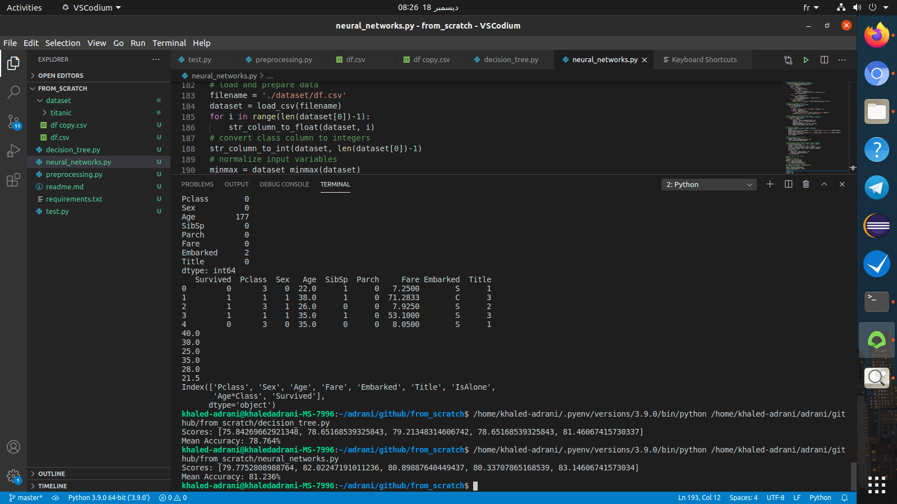

# Projet de Data Mining

## Khaled Adrani, Mohamed Mbarek, Yafaa Ben Tili

# Introduction

Dans ce projet, nous allons utiliser deux algorithmes de Data Mining pour prédire la survivabilité des personnes issues de la dataset des survivants du Titanic. Les deux algorithmes sont l'arbre de décision et les réseaux de neurones.

# Data preprocessing

https://www.kaggle.com/c/titanic/data

Les données ont été divisées en deux groupes:

*train.csv
*test.csv

Pour ce projet, on a utilisé seulement le fichier train.csv.

* survie:	Survie	0 = Non, 1 = Oui
* pclass:	Classe de billet	1 = 1er, 2 = 2ème, 3 = 3ème
* sexe:	Sexe	
* Âge:	Age en années	
* sibsp:	# de frères et sœurs / conjoints à bord du Titanic	
* parch:	# de parents / enfants à bord du Titanic	
* billet:	Numéro de billet	
* tarif:	Tarif passager	
* cabine:	Numéro de cabine	
* embarqué:	Port d'Embarquation

Le fichier preprocessing.py contient tous les processus de préparation de Data pour les algorithmes de prédiction.

# Arbre de décision:

Le code de cet algorithme se trouve dans le fichier decision_tree.py. Par suite, vous trouverz des explications sur les notions utilisés pour développer le code.

Les arbres de décision sont une méthode de prédiction puissante et extrêmement populaire.

Ils sont populaires parce que le modèle final est si facile à comprendre par les praticiens et les experts du domaine. L'arbre de décision final peut expliquer exactement pourquoi une prédiction spécifique a été faite, ce qui la rend très intéressante pour une utilisation opérationnelle.

Les arbres de décision fournissent également la base de méthodes d'ensemble plus avancées telles que l'ensachage, les forêts aléatoires et le renforcement de gradient.

## Indice de Gini
L'indice Gini est le nom de la fonction de coût utilisée pour évaluer les fractionnements dans l'ensemble de données.

Une division dans l'ensemble de données implique un attribut d'entrée et une valeur pour cet attribut. Il peut être utilisé pour diviser les modèles d'apprentissage en deux groupes de lignes.

Un score Gini donne une idée de la qualité d'une division par la mixité des classes dans les deux groupes créés par la division. Une séparation parfaite aboutit à un score de Gini de 0, alors que la division du pire des cas qui aboutit à des classes 50/50 dans chaque groupe aboutit à un score de Gini de 0,5 (pour un problème à 2 classes).

## Créer un fractionnement
Un fractionnement est composé d'un attribut dans l'ensemble de données et d'une valeur.

Nous pouvons résumer cela comme l'index d'un attribut à fractionner et la valeur par laquelle fractionner les lignes sur cet attribut. Il s'agit simplement d'un raccourci utile pour l'indexation dans des lignes de données.

La création d'un fractionnement comporte trois parties, la première que nous avons déjà examinée est le calcul du score de Gini. Les deux autres parties sont:

* Fractionner un ensemble de données.
* Évaluation de toutes les divisions.

## Construisez un arbre
La création du nœud racine de l'arbre est facile.

Nous appelons la fonction get_split () ci-dessus en utilisant l'ensemble de données.

Ajouter plus de nœuds à notre arbre est plus intéressant.

Construire un arbre peut être divisé en 3 parties principales:

* Nœuds terminaux.
* Fractionnement récursif.
* Construire un arbre.

Nous devons décider quand arrêter de faire pousser un arbre.

Nous pouvons le faire en utilisant la profondeur et le nombre de lignes dont le nœud est responsable dans l'ensemble de données d'entraînement.

Profondeur maximale de l'arbre . Il s'agit du nombre maximum de nœuds du nœud racine de l'arborescence. Une fois qu'une profondeur maximale de l'arbre est atteinte, nous devons arrêter le fractionnement en ajoutant de nouveaux nœuds. Les arbres plus profonds sont plus complexes et sont plus susceptibles de surajuster les données d'entraînement.
Enregistrements de nœud minimum . Il s'agit du nombre minimum de modèles de formation dont un nœud donné est responsable. Une fois à ou en dessous de ce minimum, nous devons arrêter le fractionnement et ajouter de nouveaux nœuds. On s'attend à ce que les nœuds qui représentent trop peu de modèles d'entraînement soient trop spécifiques et risquent de surajuster les données d'entraînement.
Ces deux approches seront des arguments spécifiés par l'utilisateur pour notre procédure de création d'arborescence.

Il y a une autre condition. Il est possible de choisir une division dans laquelle toutes les lignes appartiennent à un groupe. Dans ce cas, nous ne pourrons pas continuer à fractionner et à ajouter des nœuds enfants car nous n'aurons aucun enregistrement à fractionner d'un côté ou de l'autre.

Nous avons maintenant quelques idées sur le moment d'arrêter de faire pousser l'arbre. Lorsque nous arrêtons de croître à un moment donné, ce nœud est appelé nœud terminal et est utilisé pour faire une prédiction finale.

Cela se fait en prenant le groupe de lignes affecté à ce nœud et en sélectionnant la valeur de classe la plus courante dans le groupe. Cela sera utilisé pour faire des prédictions.

## Fractionnement récursif

Nous savons comment et quand créer des nœuds terminaux, maintenant nous pouvons construire notre arbre.

Construire un arbre de décision implique d'appeler la fonction get_split () développée ci- dessus encore et encore sur les groupes créés pour chaque nœud.

Les nouveaux nœuds ajoutés à un nœud existant sont appelés nœuds enfants. Un nœud peut avoir zéro enfant (un nœud terminal), un enfant (un côté fait directement une prédiction) ou deux nœuds enfants. Nous ferons référence aux nœuds enfants comme à gauche et à droite dans la représentation du dictionnaire d'un nœud donné.

Une fois qu'un nœud est créé, nous pouvons créer des nœuds enfants de manière récursive sur chaque groupe de données du fractionnement en appelant à nouveau la même fonction.

## Faire une prédiction
Faire des prédictions avec un arbre de décision implique de naviguer dans l'arbre avec la ligne de données spécifiquement fournie.

Encore une fois, nous pouvons l'implémenter en utilisant une fonction récursive, où la même routine de prédiction est appelée à nouveau avec les nœuds enfants gauche ou droit, en fonction de la façon dont la division affecte les données fournies.

Il faut vérifier si un nœud enfant est soit une valeur terminale à renvoyer comme prédiction, soit s'il s'agit d'un nœud de dictionnaire contenant un autre niveau de l'arbre à considérer.

# Réseau de Neurones avec backtracking:

Le code de cet algorithme se trouve dans le fichier neural_networks.py. 

L'algorithme de rétropropagation (backtracking) est une méthode d'apprentissage supervisé pour les réseaux à réaction multicouche dans le domaine des réseaux de neurones artificiels.

Les réseaux de neurones à réaction directe sont inspirés du traitement de l'information d'une ou plusieurs cellules neuronales, appelées neurones. Un neurone accepte les signaux d'entrée via ses dendrites, qui transmettent le signal électrique au corps cellulaire. L'axone transporte le signal vers les synapses, qui sont les connexions de l'axone d'une cellule aux dendrites d'une autre cellule.

Le principe de l'approche de rétropropagation est de modéliser une fonction donnée en modifiant les pondérations internes des signaux d'entrée pour produire un signal de sortie attendu. Le système est formé à l'aide d'une méthode d'apprentissage supervisé, dans laquelle l'erreur entre la sortie du système et une sortie attendue connue est présentée au système et utilisée pour modifier son état interne.

Techniquement, l'algorithme de rétropropagation est une méthode pour entraîner les poids dans un réseau neuronal multicouche à réaction directe. En tant que tel, il nécessite qu'une structure de réseau soit définie d'une ou plusieurs couches où une couche est entièrement connectée à la couche suivante. Une structure de réseau standard est une couche d'entrée, une couche cachée et une couche de sortie.

La rétropropagation peut être utilisée à la fois pour les problèmes de classification et de régression, mais nous nous concentrerons sur la classification dans ce didacticiel.

Dans les problèmes de classification, les meilleurs résultats sont obtenus lorsque le réseau a un neurone dans la couche de sortie pour chaque valeur de classe. Par exemple, un problème de classification à 2 classes ou binaire avec les valeurs de classe de A et B. Ces sorties attendues devraient être transformées en vecteurs binaires avec une colonne pour chaque valeur de classe. Tels que [1, 0] et [0, 1] pour A et B respectivement. C'est ce qu'on appelle un encodage à chaud.

Chaque neurone a un ensemble de poids qui doivent être maintenus. Un poids pour chaque connexion d'entrée et un poids supplémentaire pour la polarisation. Nous aurons besoin de stocker des propriétés supplémentaires pour un neurone pendant l'entraînement, par conséquent, nous utiliserons un dictionnaire pour représenter chaque neurone et stocker les propriétés par des noms tels que « poids » pour les poids.

Un réseau est organisé en couches. La couche d'entrée n'est en réalité qu'une ligne de notre ensemble de données d'entraînement. La première couche réelle est la couche cachée. Ceci est suivi par la couche de sortie qui a un neurone pour chaque valeur de classe.

Nous organiserons les couches comme des tableaux de dictionnaires et traiterons l'ensemble du réseau comme un tableau de couches.

Il est recommandé d'initialiser les poids de réseau à de petits nombres aléatoires. Dans ce cas, utiliserons-nous des nombres aléatoires compris entre 0 et 1.

Vous trouverez ci-dessous une fonction nommée initialize_network () qui crée un nouveau réseau neuronal prêt pour la formation. Il accepte trois paramètres, le nombre d'entrées, le nombre de neurones à avoir dans la couche cachée et le nombre de sorties.

Vous pouvez voir que pour la couche cachée, nous créons n_hidden neurones et chaque neurone dans la couche cachée a n_inputs + 1 poids, un pour chaque colonne d'entrée dans un ensemble de données et un supplémentaire pour le biais.

Vous pouvez également voir que la couche de sortie qui se connecte à la couche cachée a n_outputs neurones, chacun avec n_hidden + 1 poids. Cela signifie que chaque neurone de la couche de sortie se connecte à (a un poids pour) chaque neurone de la couche cachée.

Comment coder un réseau de neurones avec rétropropagation en Python (à partir de zéro)
par Jason Brownlee le 7 novembre 2016 dans Code Algorithms From Scratch
Tweet  Partager
Dernière mise à jour le 1 décembre 2019

L'algorithme de rétropropagation est utilisé dans le réseau neuronal artificiel classique à rétroaction.

C'est la technique encore utilisée pour former de grands réseaux d' apprentissage profond .

Dans ce tutoriel, vous découvrirez comment implémenter l'algorithme de rétropropagation pour un réseau de neurones à partir de zéro avec Python.

Après avoir terminé ce tutoriel, vous saurez:

Comment propager en avant une entrée pour calculer une sortie.
Comment rétro-propager l'erreur et former un réseau.
Comment appliquer l'algorithme de rétropropagation à un problème de modélisation prédictive du monde réel.
Lancez votre projet avec mon nouveau livre Algorithmes d'apprentissage automatique à partir de zéro , y compris des didacticiels étape par étape et les fichiers de code source Python pour tous les exemples.

Commençons.

Mise à jour Nov / 2016 : Correction d'un bug dans la fonction activate (). Merci Alex!
Mise à jour de janvier / 2017 : corrige les problèmes avec Python 3.
Mise à jour janvier / 2017 : mise à jour d'un petit bogue dans update_weights (). Merci Tomasz!
Mise à jour avril / 2018 : Ajout d'un lien direct vers l'ensemble de données CSV.
Mise à jour août / 2018 : Testé et mis à jour pour fonctionner avec Python 3.6.
Mise à jour septembre / 2019 : mise à jour de Wheat-seeds.csv pour résoudre les problèmes de formatage.
Comment implémenter l'algorithme de rétropropagation à partir de zéro en Python
Comment implémenter l'algorithme de rétropropagation à partir de zéro dans Python
Photo par NICHD , certains droits réservés.

La description
Cette section fournit une brève introduction à l'algorithme de rétro-propagation et à l'ensemble de données Wheat Seeds que nous utiliserons dans ce didacticiel.

Algorithme de rétropropagation
L'algorithme de rétropropagation est une méthode d'apprentissage supervisé pour les réseaux à réaction multicouche dans le domaine des réseaux de neurones artificiels.

Les réseaux de neurones à réaction directe sont inspirés du traitement de l'information d'une ou plusieurs cellules neuronales, appelées neurones. Un neurone accepte les signaux d'entrée via ses dendrites, qui transmettent le signal électrique au corps cellulaire. L'axone transporte le signal vers les synapses, qui sont les connexions de l'axone d'une cellule aux dendrites d'une autre cellule.

Le principe de l'approche de rétropropagation est de modéliser une fonction donnée en modifiant les pondérations internes des signaux d'entrée pour produire un signal de sortie attendu. Le système est formé à l'aide d'une méthode d'apprentissage supervisé, dans laquelle l'erreur entre la sortie du système et une sortie attendue connue est présentée au système et utilisée pour modifier son état interne.

Techniquement, l'algorithme de rétropropagation est une méthode pour entraîner les poids dans un réseau neuronal multicouche à réaction directe. En tant que tel, il nécessite qu'une structure de réseau soit définie d'une ou plusieurs couches où une couche est entièrement connectée à la couche suivante. Une structure de réseau standard est une couche d'entrée, une couche cachée et une couche de sortie.

La rétropropagation peut être utilisée à la fois pour les problèmes de classification et de régression, mais nous nous concentrerons sur la classification dans ce didacticiel.

Dans les problèmes de classification, les meilleurs résultats sont obtenus lorsque le réseau a un neurone dans la couche de sortie pour chaque valeur de classe. Par exemple, un problème de classification à 2 classes ou binaire avec les valeurs de classe de A et B. Ces sorties attendues devraient être transformées en vecteurs binaires avec une colonne pour chaque valeur de classe. Tels que [1, 0] et [0, 1] pour A et B respectivement. C'est ce qu'on appelle un encodage à chaud.

Ensemble de données sur les graines de blé
L'ensemble de données sur les semences implique la prédiction d'espèces à partir de mesures de semences de différentes variétés de blé.

Il y a 201 enregistrements et 7 variables d'entrée numériques. C'est un problème de classification avec 3 classes de sortie. L'échelle de chaque valeur d'entrée numérique varie, de sorte qu'une certaine normalisation des données peut être nécessaire pour une utilisation avec des algorithmes qui pondèrent des entrées comme l'algorithme de rétropropagation.

Vous trouverez ci-dessous un exemple des 5 premières lignes de l'ensemble de données.

15.26,14.84,0.871,5.763,3.312,2.221,5.22,1
14.88,14.57,0.8811,5.554,3.333,1.018,4.956,1
14.29,14.09,0.905,5.291,3.337,2.699,4.825,1
13.84,13.94,0.8955,5.324,3.379,2.259,4.805,1
16.14,14.99,0.9034,5.658,3.562,1.355,5.175,1
1
2
3
4
5
15.26,14.84,0.871,5.763,3.312,2.221,5.22,1
14.88,14.57,0.8811,5.554,3.333,1.018,4.956,1
14.29,14.09,0.905,5.291,3.337,2.699,4.825,1
13.84,13.94,0.8955,5.324,3.379,2.259,4.805,1
16.14,14.99,0.9034,5.658,3.562,1.355,5.175,1
En utilisant l'algorithme de règle zéro qui prédit la valeur de classe la plus courante, la précision de base du problème est de 28,095%.

Vous pouvez en savoir plus et télécharger le jeu de données de départ à partir du référentiel UCI Machine Learning .

Téléchargez le jeu de données seeds et placez-le dans votre répertoire de travail actuel avec le nom de fichier seeds_dataset.csv .

L'ensemble de données est au format séparé par des tabulations, vous devez donc le convertir en CSV à l'aide d'un éditeur de texte ou d'un tableur.

Mettre à jour, télécharger directement le jeu de données au format CSV:

Télécharger l'ensemble de données sur les graines de blé
Didacticiel
Ce tutoriel se décompose en 6 parties:

Initialisez le réseau.
Propager en avant.
Retour Erreur de propagation.
Réseau ferroviaire.
Prédire.
Étude de cas du jeu de données sur les semences.
Ces étapes fourniront la base dont vous avez besoin pour implémenter l'algorithme de rétropropagation à partir de zéro et l'appliquer à vos propres problèmes de modélisation prédictive.

1. Initialiser le réseau
Commençons par quelque chose de simple, la création d'un nouveau réseau prêt pour la formation.

Chaque neurone a un ensemble de poids qui doivent être maintenus. Un poids pour chaque connexion d'entrée et un poids supplémentaire pour la polarisation. Nous aurons besoin de stocker des propriétés supplémentaires pour un neurone pendant l'entraînement, par conséquent, nous utiliserons un dictionnaire pour représenter chaque neurone et stocker les propriétés par des noms tels que « poids » pour les poids.

Un réseau est organisé en couches. La couche d'entrée n'est en réalité qu'une ligne de notre ensemble de données d'entraînement. La première couche réelle est la couche cachée. Ceci est suivi par la couche de sortie qui a un neurone pour chaque valeur de classe.

Nous organiserons les couches comme des tableaux de dictionnaires et traiterons l'ensemble du réseau comme un tableau de couches.

Il est recommandé d'initialiser les poids de réseau à de petits nombres aléatoires. Dans ce cas, utiliserons-nous des nombres aléatoires compris entre 0 et 1.

Vous trouverez ci-dessous une fonction nommée initialize_network () qui crée un nouveau réseau neuronal prêt pour la formation. Il accepte trois paramètres, le nombre d'entrées, le nombre de neurones à avoir dans la couche cachée et le nombre de sorties.

Vous pouvez voir que pour la couche cachée, nous créons n_hidden neurones et chaque neurone dans la couche cachée a n_inputs + 1 poids, un pour chaque colonne d'entrée dans un ensemble de données et un supplémentaire pour le biais.

Vous pouvez également voir que la couche de sortie qui se connecte à la couche cachée a n_outputs neurones, chacun avec n_hidden + 1 poids. Cela signifie que chaque neurone de la couche de sortie se connecte à (a un poids pour) chaque neurone de la couche cachée.

## Propagation vers l'avant
Nous pouvons calculer une sortie d'un réseau neuronal en propageant un signal d'entrée à travers chaque couche jusqu'à ce que la couche de sortie délivre ses valeurs.

Nous appelons cela la propagation vers l'avant.

C'est la technique dont nous aurons besoin pour générer des prédictions pendant l'entraînement qui devra être corrigée, et c'est la méthode dont nous aurons besoin après l'entraînement du réseau pour faire des prédictions sur de nouvelles données.

Nous pouvons diviser la propagation en avant en trois parties:

* Activation des neurones.
* Transfert de neurones.
* Propagation vers l'avant.

## Activation des neurones
La première étape consiste à calculer l'activation d'un neurone à partir d'une entrée.

L'entrée peut être une ligne de notre ensemble de données d'entraînement, comme dans le cas de la couche masquée. Il peut également s'agir des sorties de chaque neurone de la couche cachée, dans le cas de la couche de sortie.

L'activation des neurones est calculée comme la somme pondérée des entrées. Tout comme la régression linéaire.

## Transfert de neurones
Une fois qu'un neurone est activé, nous devons transférer l'activation pour voir ce qu'est réellement la sortie du neurone.

Différentes fonctions de transfert peuvent être utilisées. Il est traditionnel d'utiliser la fonction d'activation sigmoïde , mais vous pouvez également utiliser la fonction tanh ( tangente hyperbolique ) pour transférer les sorties. Plus récemment, la fonction de transfert de redresseur a été populaire auprès des grands réseaux d'apprentissage en profondeur.

La fonction d'activation sigmoïde ressemble à une forme en S, elle est également appelée fonction logistique. Il peut prendre n'importe quelle valeur d'entrée et produire un nombre entre 0 et 1 sur une courbe en S. C'est aussi une fonction dont nous pouvons facilement calculer la dérivée (pente) dont nous aurons besoin plus tard lors de la rétropropagation de l'erreur.

## Propagation vers l'avant
La propagation vers l'avant d'une entrée est simple.

Nous travaillons sur chaque couche de notre réseau en calculant les sorties pour chaque neurone. Toutes les sorties d'une couche deviennent des entrées vers les neurones de la couche suivante.

Vous trouverez ci-dessous une fonction nommée forward_propagate () qui implémente la propagation avant pour une ligne de données de notre ensemble de données avec notre réseau de neurones.

Vous pouvez voir que la valeur de sortie d'un neurone est stockée dans le neurone avec le nom « sortie ». Vous pouvez également voir que nous collectons les sorties pour une couche dans un tableau nommé new_inputs qui devient les entrées du tableau et est utilisé comme entrées pour la couche suivante.

## Prédire
Faire des prédictions avec un réseau neuronal formé est assez simple.

Nous avons déjà vu comment propager en avant un modèle d'entrée pour obtenir une sortie. C'est tout ce que nous devons faire pour faire une prédiction. Nous pouvons utiliser les valeurs de sortie elles-mêmes directement comme la probabilité d'un modèle appartenant à chaque classe de sortie.

Il peut être plus utile de transformer cette sortie en une prédiction de classe précise. Nous pouvons le faire en sélectionnant la valeur de classe avec la probabilité la plus élevée. Ceci est également appelé la fonction arg max.

# Conclusion

Nous avons obtenu 78% de précision pour l'arbe de décision et 81% de précision pour le réseau de neurones. On conclue que le problème n'est pas lié à la structure de ces algorithmes mais plutot au Data Preprocessing. Encore plus, il faut optimiser notre processus de l'ingeniérie des attributs (feature engineering) afin d'augmenter la précision de nos données. Un autre raison pour amélioer la performance de nos modèles est d'essayer de trouver des quantités de données supplémentaires. 

